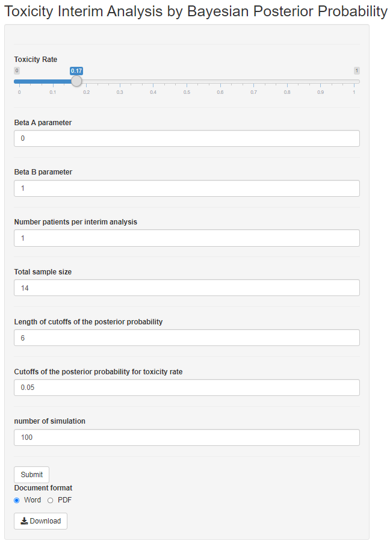

# Bayesian Toxicity Interim Analysis 
 
 

## Features

 

## Installation

Simply run the following from an R console:

```r
if (!require("devtools"))
  install.packages("devtools")
devtools::install_github("dungtsa/BayesianToxicityInterimAnalysis",force = TRUE)
```

## Getting Started

```r
require("BayesianToxicityInterimAnalysis")
ToxicityShinyApp()
```
-------------------------------
Snapshot of shiny app: initial 


 
